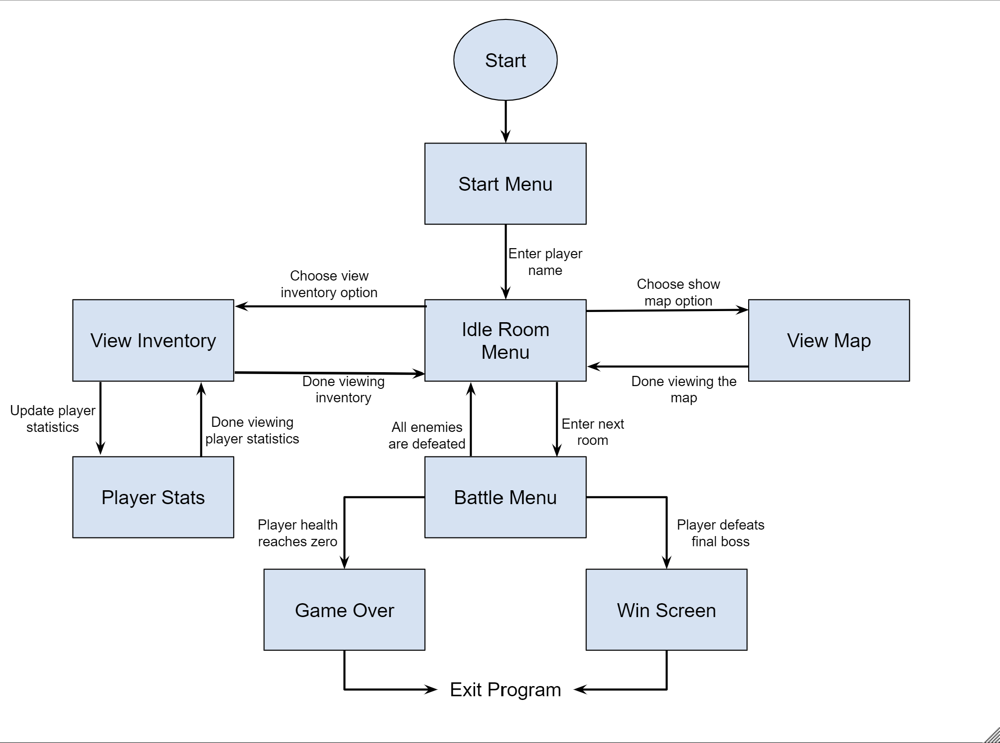
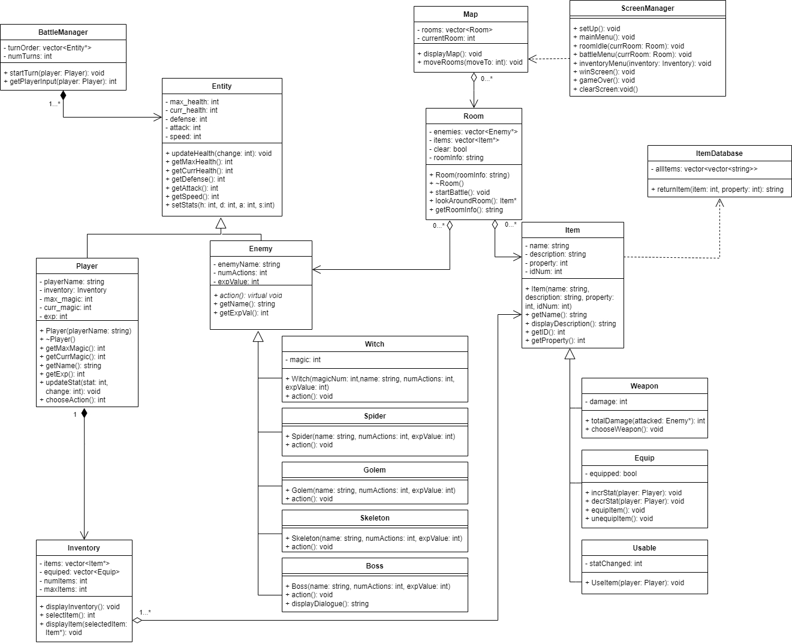

 
# Escape Dungeon

 > Authors: \<[Gabriel Vasquez](https://github.com/GoodfellaGabe)\>
	\<[Connor Claborn](https://github.com/connorcla)\>
	\<[Eliot Lee](https://github.com/swooshoo)\>
		\<[Jonathoon Hoang](https://github.com/Janathoon)\>

## Project Description
### General Description
This program is a terminal and text based role playing game in which players can choose their character in order to enter and progress through a dungeon and get out safely. The player will start with minimal equipment and is forced to trek through a mysterious and unknown labyrinth navigating from room to room in order to get to the exit. Through this dungeon, the player will be able to obtain items to increase their chances of survival through tools to navigate through the dungeon better and weapons to face off against enemies that lurk in the dark. The player will have to fight through enemies with items and experience gained in order to travel from room to room, uncovering why they are there and to eventually escape.

### Why it is important or interesting?
A lot of software today is involved in some sort of entertainment with a large market in the realm of digital gaming. These games are defined by unique and complex systems or mechanics that make them stand out from other forms of entertainment in addition to immersion as the player is in full control of their character, acting as they like in game. This will be a project that will bring enjoyment to others as they are able to run and play our program, taking a new path each time they enter the dungeon, and experiencing their adventure once more.

### Languages/Tools/Technologies
**C++**: This is the main language this project will be programmed in.

**VSCode**: Visual Studio Code is the IDE and text editor that will be used to write and test code in.

**Git**: Git allows us to work collaboratively on this project by maintaining a version control system, make and edit branches for new features, and commit to a central repository.  

**GitHub**: GitHub is a central area located on an accessible server to visualize our version control system. This will allow for better organization in our collaboration by creating project boards in order to assign tasks which will be completed individually and added together in the GitHub repository. 

**Valgrind**: Used as a debugging tool, Valgrind helps detect memory leaks, find uninitialized memory, and profile memory usage. With the development of a game project, this is important to manage quickly growing memory and detect unpredictable behavior & crashes.Profiling memory usage allows to identify areas where memory should be optimized or reduced.

**CMake**: Allows us as developers to specify build processes, manage dependencies, and organize our project’s source code. In the context of an RPG game, it could help manage any external libraries we may use and specify build types for debugging purposes. Seeing that the project is also a collaborative project, CMake’s ability to organize the source code into logical modules makes it easier to manage the scale of the project 

### Input/Output of Project?
**Input**: A user will be prompted by Terminal to select menu options (i.e. “1-Talk to the tavern owner, 2 - Open quest log, 3- Open inventory) etc.) The story will progress differently and the user may pick alternate endings depending on the user’s inputs (i.e. failing to use a heal item when needed could result in character death). 

**Output**: The output will be on Terminal such as dialogue, storyline, menu options for the next user input, and maybe even combining symbols to create backgrounds or characters.

### Project Features
Players should be able to select and/or create their character they want to use to navigate through the dungeon. They will be able to view and manage their player’s statistics and choose which skills to increase or level up as the game progresses. Along with this character management, heal and magic counters will be shown to let the player know of any available resources as well as menus showing different options or actions their player can take.

As players navigate through the dungeon, they  will be able to access and view a map of the dungeon including the rooms visited, any significant characters, and any unchecked rooms. Players can choose which direction to explore in and can investigate or use different actions around rooms prompting different responses. By navigating, players can find other characters that can help them on their journey, or give them information about the place they are attempting to escape from.

Through their journey players can obtain and use items that will aid them in fights or navigating through the rooms. Items will be obtained by defeating enemies or finding special rooms and can be viewed in an inventory. These items will be able to be used either in battle against enemies or in the map in order to aid in navigating.

Players will come across enemies during their journey which will be prompted by either entering or performing certain actions in rooms. Fighting enemies will prompt a special battle menu that will provide players several options including attack, defend, or use an item. Players will have to defeat all enemies and will be rewarded upon doing so.

## User Interface Specification

### Navigation Diagram

### Screen Layouts

Document for Screen Layouts: [Link to Screen Layouts](Documents/CS100_FinalProject_ScreenLayout.pdf)

__Main Menu:__
_____________________________________________________________________________________________________________________________
Escape Dungeon

Can you:
 Build your arsenal, 
 Battle through enemies,
 Reach the end before you are stopped?

Enter your name to begin:
_____________________________________________________________________________________________________________________________

  __Idle Room:__
_____________________________________________________________________________________________________________________________
You find yourself in a damp room and nothing seems to be moving except the flicker of the torches on the walls.

What would you like to do?
1. Look around the room for any items
2. Examine the room
3. View inventory
4. View map
5. Move to the next room

Enter your choice (1-5): 
_____________________________________________________________________________________________________________________________

  __Map:__
 Will update rooms as player progress through the game
_____________________________________________________________________________________________________________________________
Current Map: 
 A map that you were gripping when you woke up. 
<pre>
 ______________________________________________________________________________________________________________
 |         |         |         |        |           |           |           |           |           |         |
 |  Start  |  Clear  |  Clear  |  Here  |     ?     |     ?     |     ?     |     ?     |     ?     |   Exit? |
 |         |         |         |        |           |           |           |           |           |         |
 ______________________________________________________________________________________________________________
</pre>

 Start: Where you woke up and began your journey.
 Clear: All enemies have been vanquished from there, there’s no use going back.
 Here: You are currently in this room.
 ?: Unexplored rooms, wonder what lies ahead.
 Exit?: Marked as a possible escape, hopefully this map tells the truth.

Enter (b) to stop viewing your map: 
_____________________________________________________________________________________________________________________________

  __Inventory:__
 Item[x] will be replaced with item names. Items will be alphabetically sorted. 
 Equip Slots will be filled with the number corresponding to the item that is equipped.
_____________________________________________________________________________________________________________________________
Satchel:
 1. Item[1]     2. Item[2]     3. Item[3]     4. Item[4]     5. Item[5]
 6. Item[6]     7. Item[7]     8. Item[8]     9. Item[9]     10. Item[10]  
  …
Equip Slots:

|  1  |      |  2  |      |  3  |

Enter item number (1-[numItems]) to view that item or enter 0 to see your stats:
_____________________________________________________________________________________________________________________________

  __Player Stats:__
 Numbers will change depending on the player's choices and progress through the game.
_____________________________________________________________________________________________________________________________
Your Current Statistics:

Maximum Health: 50
 Maximum Magic: 50
 Attack: 10
 Defense: 10
 Speed: 10
 EXP: 35

You can increase any statistic by 1 point by spending 10 EXP.
 Enter which statistic you wish to increase (H,M,A,D,S) or enter (b) to go back to satchel: 
_____________________________________________________________________________________________________________________________

  __Battle Menu:__
 Enemy[x] will be replaced with enemy names.
 List of enemy actions will appear after the player has made their choice, then the menu will reset and the player will be able to choose their next action depending on the previous actions.
 (Optional lines based on player choice)
_____________________________________________________________________________________________________________________________
Monsters block your path:

Enemy[1]     Enemy[2]     Enemy[3]     Enemy[4]
<pre>
___________________________________________________________________
Health: 27/50    Magic: 35/50
___________________________________________________________________
</pre>
What would you like to do? 
1. Attack an enemy
2. Use an item
3. Attempt to flee (return to previous room)

Enter your choice (1-3): 
 (1: Which enemy would you like to attack ordered from left to right (1-x): )
 (2: UsableItem[1]     UsableItem[2]     UsableItem[3]
      Which item would you like to use (1-x) or go back to the menu (b): )
 (3: You can attempt to flee at a certain success rate (50%), do you want to try (y/n): )

List of enemy actions:
 EnemyAction[1] 
 EnemyAction[2] 
 EnemyAction[3] 
 EnemyAction[4] 
_____________________________________________________________________________________________________________________________

  __Game Over Screen:__
_____________________________________________________________________________________________________________________________
GAME OVER

Your health has dropped to 0 and now your progress is lost to the dungeon once more…
 Can you find the courage to attempt to escape again?

Enter anything to exit:
_____________________________________________________________________________________________________________________________

  __Win Screen:__
_____________________________________________________________________________________________________________________________
CONGRATULATIONS!!!

You have overcome the trials and tribulations set before and escaped with only your wits and what you could find! But have you found all the secrets hidden in this dungeon or found every powerful item? Or maybe the dungeon calls once more…

Enter anything to exit:
_____________________________________________________________________________________________________________________________

## Class Diagram

### Description of the UML CLass Diagram: 
**ScreenManager class**
 A class that is created and called when the program starts in order to set up the maps and current rooms loaded in addition to moving between the screens.

This class implements functions that print each screen and determines what will be displayed on those particular screens. When the program is first started, the ScreenManager will be created and display the main menu, awaiting input from the player to move to the next screen depending on the input. Depending on the input, corresponding objects will be created or updated then the next screen will be printed such as the roomIdle screen, battle menu, or inventory. This class will manage the main inputs, prompting the player to input their choice, then take the input and pass it to other classes such as the Map, Room, or Inventory classes.

 **Map class**
 There is only one Map class present during the program which will contain a vector of Room objects that will be the line of Rooms the player will have to travel through in addition to an index indicating the current Room the player is in. 

This Map class implements functions including displayMap which will be called during a screen transition and will iterate through all Rooms in the Room vector to determine if they are cleared, unknown, or the current room. These states can then be printed to the screen in singular boxes that represent the Rooms. This class also implements a moveRooms function that is called when the player goes to the next or previous room so the currentRoom variable is updated in preparation for the next displayMap call. 

 **Room class**
 A Room has a vector of Enemy pointers which will contain all the current enemies located in that Room. The Room will also be created with a vector of Item pointers that contains the available items in the Room that the player will be able to find by choosing to look around the Room. Finally, the Room has a clear boolean variable which will indicate if the Room has enemies and is safe or not, and contains a string called roomInfo that contains unique information about the Room that the player can examine. 

The Room will be constructed with an imputed roomInfo as well as a randomly generated number of enemies and items once the player enters the Room. Right after the Room is constructed, startBattle will be called which will create a BattleManager and proceed to the battle menu which will continue until the Enemy pointer vector is empty and the Room will be set to clear. The lookAroundRoom function will randomly select an item from the Item pointer vector and give a success chance for the player to obtain the item. Finally, the getRoomInfo function is implemented by printing the roomInfo string to the screen, then prompting the player for the next choice of action.

 **ItemDatabase class**
 Only one ItemDatabase is present in the program that will hold all programmed items in the game. All items are contained within a two-dimensional vector, with each row containing a singular item and each column containing a property of that item including the name, description, property, and idNum. 

To access the items in this database, the returnItem function is implemented by taking two integers as parameters, the first indicates the row, or item, and the second indicates the property, or column, which returns a string that can then be converted to other data types when an Item is constructed for the player to obtain. 

 **Item base class**
 An abstract base class that other items of three types, Weapon, Usable, and Equip, will inherit from and contains basic information that all items will have including its name, description, property, and its idNum.

It has a set of getter functions to return all of these internal values for each item and no setters are required as these values for items should not be changed after the item is constructed.

 **Weapon class that inherits from Item**
 A Weapon has an integer that represents damage. A Weapon will be constructed similarly to its inherited Item having a name, description, and property which will influence the damage number. 

A Weapon will implement the totalDamage function which takes an Enemy* as an input which will then subtract the damage value from the weapon from that Enemy’s health. A chooseWeapon function will also be implemented so a specific Weapon object is indicated from the inventory so only one Weapon damage is applied. 

 **Equip class that inherits from Item**
 A Equip has a boolean equipped that will indicate whether that item is equipped to the Player or not and will influence whether the player gets a boosted stat or not.

IncrStat and decrStat functions are implemented that check if the item is equipped to the passed in Player, and if they are, then the incrStat function will increase the corresponding stat and the decrStat function will decrease the corresponding stat. The equipItem and unequipItem functions will set the value of the equipped boolean based on the player inputs in the inventory menu.

 **Usable class that inherits from Item**
 A Usable will have a statChanged integer in addition to the other variables set by the inherited Item that will indicate which stat will be affected by the item being used. The amount that will be affected is determined by the property integer in the inherited Item class.

The useItem function is implemented by passing in a Player object which will then take the statChanged integer to determine which stat to update on the Player and the value changed will be determined from the property integer.

 **Entity base class**
 The Entity class is an abstract base class which both the Player class and Enemies will inherit from. This class has both standard variables for statistics such as health, defense, attack, and speed as well as implementations for getter and setter functions for those variables that inherited objects will have. 

The implemented functions will include getters for all individual statistic variables and one setter function that will take in arguments for each of the statistics gathered from player’s choices or equipable times. An updateHealth function will also take an integer as an argument which will be called any time damage is dealt or a heal item is used and will update the Entity’s health accordingly.

 **Player class that inherits from Entity**
 The Player class has a string name that will be input upon construction of the object in addition to an Inventory that is linked to the Player which they will be able to access through this item. In addition to other statistics, the Player also has maximum and current magic through integers that will be the cost for certain items. 

The Player constructor takes the Player name as the only argument to initialize the Player object. Getter functions are implemented in order to retrieve any extra statistics that would be needed to be used in battle functions and a setter is implemented through the updateStat function which takes two integers as arguments indicating the stat that would be changed and the value that it is changed by. Finally, the chooseAction function is implemented by allowing input for the Player to choose an action from accessing their inventory, to attacking with a weapon, or attempting to flee.

 **Enemy abstract class that inherits from Entity**
 The Enemy class is an abstract base class that all enemies will inherit from. This class contains the functions and variables that all enemies will need to have. The constructor will accept a name from the player that determines which enemy to fight next.
Each enemy will have its own name (Witch, Spider, Golem, Skeleton, and Boss). Each enemy also contains their own number of actions to execute while fighting the player. The number of actions is determined by the level/area of the dungeon the player is located at. The enemy’s action will be determined by the player’s input. Each enemy will have their own unique “expValue” which is what increases the player’s abilities every time an enemy is defeated. Each enemy gives its own unique “expValue” amount. The higher level the enemy, the more “expValue” the player will receive. 

The implementation functions will be two getter functions and one virtual function that each enemy will uniquely use. Enemies will use the same getter functions to return the enemy’s name and expValue when called. Enemies will use the same “action” virtual function to combat with the player. Action is unique for each enemy.

 **Witch class that inherits from Enemy**
 The Witch has an integer magic that is initialized from the constructor which takes the maximum magic as an integer argument. 

A Witch has an implementation of the action where it has a certain number of possible actions and one is randomly chosen. Then appropriate damage is applied to the Player with the action being output during the turn output.

 **Spider class that inherits from Enemy**
 The Spider inherits from the Enemy class which will construct based on the enemy name, numActions, and exp value input.

A Spider has an implementation of the action where it has a certain number of possible actions and one is randomly chosen. Then appropriate damage is applied to the Player with the action being output during the turn output.

 **Golem class that inherits from Enemy**
 The Golem inherits from the Enemy class which will construct based on the enemy name, numActions, and exp value input.

A Golem has an implementation of the action where it has a certain number of possible actions and one is randomly chosen. Then appropriate damage is applied to the Player with the action being output during the turn output.

 **Skeleton class that inherits from Enemy**
 The Skeleton inherits from the Enemy class which will construct based on the enemy name, numActions, and exp value input.

A Skeleton has an implementation of the action where it has a certain number of possible actions and one is randomly chosen. Then appropriate damage is applied to the Player with the action being output during the turn output.

 **Boss class that inherits from Enemy**
 Gets the Boss stats, generates random numbers associated with Boss’s move kit. Could be an attack against the player, something that makes the boss stronger. Then says some dialogue to the player through the implementation of the displayDialogue function which outputs text to the screen. 

A Boss has an implementation of the action where it has a certain number of possible actions and one is randomly chosen. Then appropriate damage is applied to the Player with the action being output during the turn output.

 **Inventory class**
 The Inventory class has a vector of Item pointers which will be sorted alphabetically in addition to a vector of Equip objects that will represent the currently equipped Items the Player has. The integer max items will be a limit on the size of the inventory, and the current number of items will be stored in the integer numItems. 

The Inventory class displays the players inventory, which will be sorted alphabetically through the implementation of displayInventory which will help print to the screen. Then there will be slots where the player can equip items to bring to battle with them through the selectItem where they can view the descriptions and choose certain items through output on the screen. 

 **BattleManager**
 The BattleManager class has a vector of Entity pointers which is a list of all Entities (Player and Enemies) currently in battle which are sorted by their speed stat. It also has an integer numTurns to indicate how many turns have passed in the battle.

The startTurn function is implemented by taking the action from the argument Player and going through the list of sorted Entities, performing their actions in that specific order. The getPlayerInput will assist in prompting and printing choices for the player in battle and taking that input and applying it accordingly for actions, inventory, or fleeing.

 
 > ## Phase III
 > You will need to schedule a check-in for the second scrum meeting with the same reader you had your first scrum meeting with (using Calendly). Your entire team must be present. This meeting will occur on week 8 during lab time.
 
 > BEFORE the meeting you should do the following:
 > * Update your class diagram from Phase II to include any feedback you received from your TA/grader.
 > * Considering the SOLID design principles, reflect back on your class diagram and think about how you can use the SOLID principles to improve your design. You should then update the README.md file by adding the following:
 >   * A new class diagram incorporating your changes after considering the SOLID principles.
 >   * For each update in your class diagram, you must explain in 3-4 sentences:
 >     * What SOLID principle(s) did you apply?
 >     * How did you apply it? i.e. describe the change.
 >     * How did this change help you write better code?
 > * Perform a new sprint plan like you did in Phase II.
 > * You should also make sure that your README file (and Project board) are up-to-date reflecting the current status of your project and the most recent class diagram. Previous versions of the README file should still be visible through your commit history.
 
> During the meeting with your reader you will discuss: 
 > * How effective your last sprint was (each member should talk about what they did)
 > * Any tasks that did not get completed last sprint, and how you took them into consideration for this sprint
 > * Any bugs you've identified and created issues for during the sprint. Do you plan on fixing them in the next sprint or are they lower priority?
 > * What tasks you are planning for this next sprint.

 
 > ## Final deliverable
 > All group members will give a demo to the reader during lab time. ou should schedule your demo on Calendly with the same reader who took your second scrum meeting. The reader will check the demo and the project GitHub repository and ask a few questions to all the team members. 
 > Before the demo, you should do the following:
 > * Complete the sections below (i.e. Screenshots, Installation/Usage, Testing)
 > * Plan one more sprint (that you will not necessarily complete before the end of the quarter). Your In-progress and In-testing columns should be empty (you are not doing more work currently) but your TODO column should have a full sprint plan in it as you have done before. This should include any known bugs (there should be some) or new features you would like to add. These should appear as issues/cards on your Project board.
 > * Make sure your README file and Project board are up-to-date reflecting the current status of your project (e.g. any changes that you have made during the project such as changes to your class diagram). Previous versions should still be visible through your commit history. 
 
 ## Screenshots
 > Screenshots of the input/output after running your application
 ## Installation/Usage
 > Instructions on installing and running your application
 ## Testing
 > How was your project tested/validated? If you used CI, you should have a "build passing" badge in this README.
 
